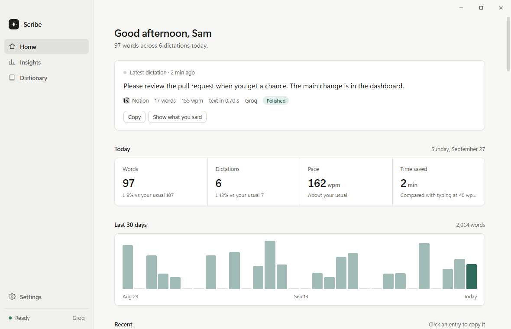
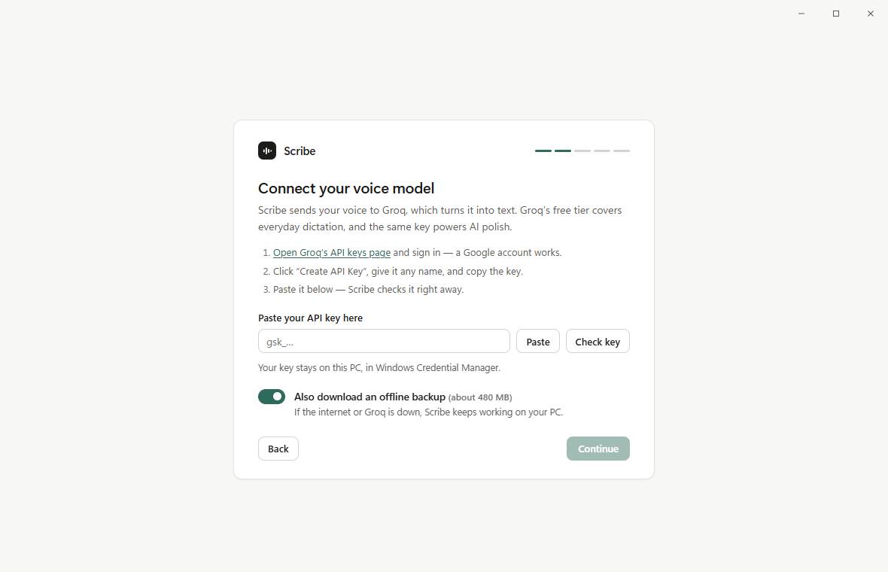
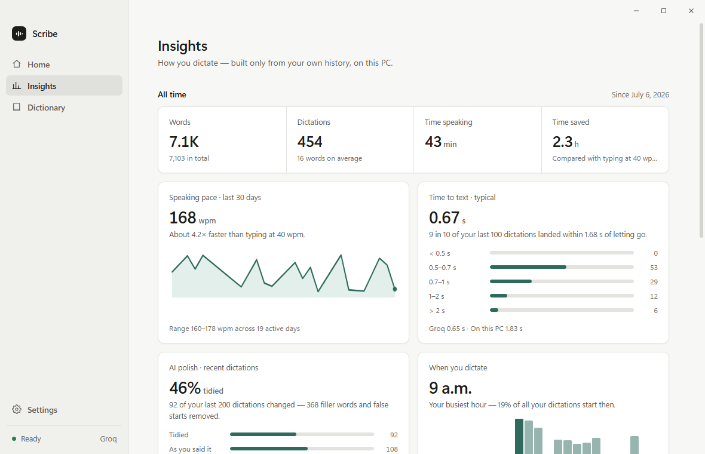

# Scribe

**Voice dictation for Windows.** Hold a hotkey, speak, let go — your words are typed
wherever your cursor is: an email, a chat, a document, a code editor, a browser.

<picture>
  <source media="(prefers-color-scheme: dark)" srcset="docs/images/home-dark.png">
  
</picture>

- **Fast and accurate.** Your voice goes to a speech model you choose — Groq (free),
  ElevenLabs (paid, the most accurate) or one that runs on your own PC — and the text
  lands a moment after you let go.
- **AI polish.** Each dictation is tidied up the way Wispr Flow does it: punctuation,
  grammar, false starts, the "um"s — without adding words you didn't say.
- **Free with one free key.** No subscription and no account with us: you bring your own
  key from Groq, whose free tier covers everyday dictation.
- **Private.** No sign-up, no tracking. Your history stays on your PC.
- **Knows your words.** Teach it names and jargon in the Dictionary.

## Install (about 3 minutes)

1. **Download [Scribe.zip](https://github.com/Dimas-100/scribe/releases/latest/download/Scribe.zip).**
2. **Extract it to `C:\`.** Right-click the ZIP → **Extract All…** → change the folder to
   `C:\` → **Extract**. You get a `C:\Scribe` folder. (Any folder you'll keep works —
   just not one inside OneDrive, which would sync all of Scribe's files.)
3. **Double-click `setup.bat`** in `C:\Scribe`.
   - Windows may double-check a file from the internet: click **Run** — or, if it says
     *"Windows protected your PC"*, **More info → Run anyway**. (`setup.bat` is a plain
     text script — open it in Notepad to see what it does.)
   - It installs everything Scribe needs — including its own copy of Python if your PC
     doesn't have one — then starts Scribe. The first time takes a few minutes.
4. **The welcome opens.** Pick **Groq (free)**, click **Open Groq's API keys page**, sign
   in, click **Create API Key**, copy it and paste it into Scribe. It's checked on the
   spot.

That's it. Hold **Ctrl + Win**, say something, let go.



Scribe starts when you sign in to Windows and waits quietly in the system tray (bottom
right, near the clock). Double-click its icon — or open **Scribe** from the Start menu —
to see the dashboard.

## Using it

| Do this | To |
|---|---|
| Hold **Ctrl + Win**, speak, release | Dictate. The text appears at your cursor. |
| **Ctrl + Win + Z** | Undo the last dictation |
| Say only **"scratch that"** | Undo the last dictation, by voice |
| Say only **"fix that"** | Polish the last dictation again |
| Say only **"new line"** / **"new paragraph"** | Insert a line break |
| Double-click the tray icon | Open the dashboard |
| Right-click the tray icon → **Quit** | Quit |

Voice commands work when they are the *whole* dictation — tap the hotkey, say just the
command, release. You can change the hotkey in **Settings**; if you use Windows'
virtual-desktop shortcuts (Ctrl + Win + ←/→), pick **Ctrl + Alt** instead.

A few things Scribe takes care of for you:

- **Your text lands where you started.** Click into another window while Scribe is
  transcribing and the text still goes to the window you were dictating into. If that
  window is gone, the text waits on your clipboard and a notification says so.
- **Back-to-back dictations arrive in order**, even if you start the next one early.
- **Windows shortcuts still work.** Holding the hotkey and pressing any other key cancels
  the dictation instead of recording it.
- **Your clipboard stays yours.** Scribe borrows it for a moment to paste, then puts back
  what you had — and dictations never show up in your clipboard history (Win + V).
- **Long dictations** can run up to 5 minutes.

## The dashboard

It follows Windows' light or dark mode, or pick one in **Settings → Appearance**.

- **Home** — what Scribe is doing right now, then your latest dictation: the text, the
  app it went to, your pace, how fast the text appeared, and whether AI polish changed
  it (**Show what you said** shows your own words). Below: today, the last 30 days and
  your recent dictations — click one to copy it.
- **Insights** — a quiet report on how you dictate: speaking pace, how fast text
  appears, how often polish helps, the hours and apps you dictate in, and the words you
  use most. Built only from your own history, on your PC.
- **Dictionary** — your names and jargon, plus suggestions from what you say often.
- **Settings** — everything Scribe can do, including your keys, AI polish and updates.



## Voice models and what they cost

| | Groq *(recommended)* | ElevenLabs | On this PC |
|---|---|---|---|
| **Cost** | Free tier (covers everyday dictation) | Paid plan (Starter is enough) | Free |
| **Speed** | About a second after you let go | Under a second — it listens while you talk | A few seconds, depending on your PC |
| **Accuracy** | Very good | The best | Good |
| **Your audio** | Sent to Groq | Sent to ElevenLabs | Never leaves your PC |
| **AI polish** | Included (same key) | Add a free Groq key | Not available |

Pick one in the welcome, or later in **Settings → Cloud**. Every key is checked with its
service before it's saved, and kept in **Windows Credential Manager** — never in a file,
never shown in full.

- **Groq** — get a key at [console.groq.com/keys](https://console.groq.com/keys) (sign in
  with Google, **Create API Key**). Silence is trimmed out before anything is sent, and a
  recording with no speech is never sent at all.
- **ElevenLabs** — get a key at elevenlabs.io → **Developers → API Keys**, with **Speech
  to Text** access (and optionally **User → Read**, so Settings can show how much of the
  month is left). Add a Groq key too and Groq becomes the backup whenever ElevenLabs
  can't answer.
- **Offline backup** — with a cloud service, Scribe also keeps a speech model on your PC
  (about 480 MB, downloaded in the background) for when the internet is down. Switch it
  off in Settings if you'd rather not.

**AI polish** (on by default with Groq) cleans each dictation up — grammar, punctuation,
false starts — keeping your meaning, tone and details, and it never adds words you
didn't say: an answer that does is thrown away and your own words are typed instead.
Choose **Light** (punctuation, capitals and the "um"s only — every other word stays) or
**Full** (also smooths rambling) in **Settings → Cloud → Polish style**. Takes of three
words or fewer are left alone, and your Dictionary always has the last word.

## Your Dictionary

Teach Scribe the words it should know — names, products, jargon. On the **Dictionary**
page you can add words, add corrections ("cal she" → "Kalshi") and accept suggestions
drawn from what you say often. Changes apply from your next dictation.

## Updates

Once a day Scribe checks whether a newer version is out and tells you (with *On this
PC* chosen, that check starts switched off — turn it on in **Settings → About**). To
update, open
**Settings → About → Update now** — Scribe closes, updates itself and opens again in
about a minute. (Or double-click `update.bat` in Scribe's folder.) Your history,
settings and keys are never touched by an update.

## Privacy

- Scribe has **no account, no analytics and no tracking**. Nothing is sent to the
  author of Scribe, ever.
- Your **audio** goes only to the voice model you chose, only while you dictate. With
  *On this PC*, nothing leaves your computer.
- With AI polish on, the **text** of each dictation is sent to Groq to be tidied.
- Once a day Scribe asks **GitHub** for the latest version number (switch it off in
  **Settings → About**; with *On this PC* it starts switched off).
- Your **keys** are stored by Windows (Credential Manager), encrypted with your sign-in.
- Your **history, settings and Dictionary** stay on your PC, in `%APPDATA%\Scribe`.

## Your data

Everything Scribe stores is in **`%APPDATA%\Scribe`** (right-click the tray icon →
**Open data folder**):

| File | What |
|---|---|
| `config.json` | Your settings (your API keys are **not** here) |
| `vocabulary.json` | Your Dictionary |
| `dictation_log.jsonl` | Your dictation history, for the dashboard |
| `cloud_usage.jsonl` | Cloud usage, for the usage meters in Settings |
| `error_log.txt` | Errors and notices, if any |

Settings and Dictionary are saved crash-safely, with a last-good backup. If a file is
ever damaged, Scribe keeps it, restores the backup and tells you.

## Uninstall

Double-click **`uninstall.bat`** in Scribe's folder. It removes Scribe from sign-in, the
Start menu and the taskbar, then asks before deleting your history, your saved keys and
the downloaded speech models. Close its window and delete the Scribe folder to finish.

## Troubleshooting

Scribe tells you when something goes wrong — with a short Windows notification that
says what it did about it — and writes the details to `error_log.txt`.

- **"Windows protected your PC" (or a security warning) when running setup.bat** —
  click **More info → Run anyway** (or **Run**). Scribe isn't signed with a paid
  certificate, so Windows doesn't recognize it.
- **setup.bat says Scribe is still inside the ZIP** — right-click the ZIP → **Extract
  All…** → `C:\` → **Extract**, then run `setup.bat` in `C:\Scribe`.
- **setup.bat says the folder is inside OneDrive** — move the Scribe folder to `C:\Scribe`
  and run `setup.bat` there. (OneDrive would copy thousands of Scribe's files to the
  cloud, and can lock them while Scribe installs or updates.)
- **setup.bat asks to install Microsoft's Visual C++ runtime** — allow it: the speech
  libraries need it, and a freshly installed Windows may not have it yet.
- **The install fails deep inside "onnxruntime"** — the folder's path is too long. Move
  the Scribe folder somewhere short, such as `C:\Scribe`, and run `setup.bat` again.
- **The welcome or the dashboard doesn't open** — usually the Microsoft Edge WebView2
  Runtime is missing (it comes with Windows 11). Scribe offers to open its
  [download page](https://developer.microsoft.com/microsoft-edge/webview2/); without it,
  Scribe sets itself up with the defaults and still works from the tray.
- **Nothing happens when I hold the hotkey** — look for a Scribe notification, check
  `error_log.txt`, or quit Scribe from the tray and start it again from the Start menu.
- **Text doesn't appear in one particular program** — programs running *as
  administrator* don't accept typing from normal apps (a Windows rule). Run that program
  normally, or paste: the text is also left on your clipboard.
- **It records from the wrong microphone** — Scribe follows your Windows default
  microphone, including when you plug one in. To always use one mic, pick it in Settings.
- **Something else** — [open an issue](https://github.com/Dimas-100/scribe/issues) and
  describe what happened. Please don't paste your API key or private dictations.

## For developers

```powershell
git clone https://github.com/Dimas-100/scribe.git C:\scribe
C:\scribe\setup.bat
```

`venv\Scripts\python app.py --show` runs Scribe with a console that shows what it's
doing. There's no build step. The tests in `tests/` are standalone scripts run from the
project root (`venv\Scripts\python tests\storage_test.py`); the safe ones use a temporary
data folder and mock the microphone, model and network. A clone updates with `git pull`
(or `update.bat`). [`CLAUDE.md`](CLAUDE.md) explains the architecture and threading
model; [`ROADMAP.md`](ROADMAP.md) lists ideas for what's next.

Requirements: Windows 10 or 11 (64-bit; ARM laptops run it through Windows' x64
emulation), a microphone, the WebView2 Runtime (built into Windows 11), Microsoft's
Visual C++ runtime (setup.bat installs it if missing), about 0.5–2 GB of disk for a local
speech model, and a 64-bit Python 3.11–3.13 (setup.bat fetches one if needed).

## License

[PolyForm Noncommercial 1.0.0](LICENSE.md) — free to use, change and share for any
noncommercial purpose. Commercial use needs the author's permission.
